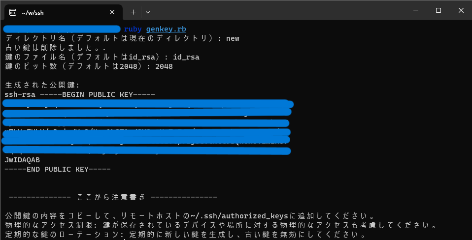
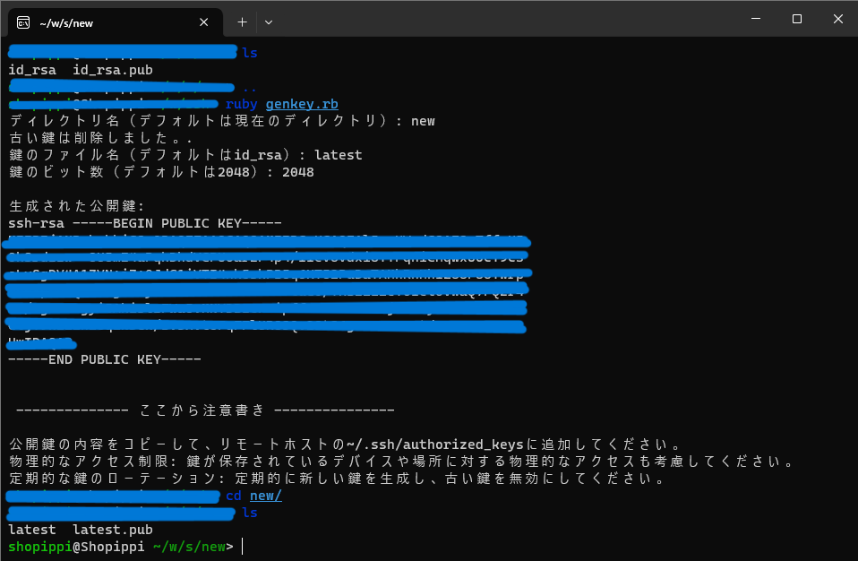

# SSH Maestro: Supreme Master of the Public Key

## Introduction:
SSH (Secure Shell) is a key protocol for secure communication over a network. However, its strong security means that proper public key management is a must. This is where "SSH Maestro" comes in: the ultimate tool for beginners in SSH connectivity to facilitate public key output and management.

### The depth of functionality:

    Public key solo-playing:
    SSH Maestro" creates the appropriate public key for each server with a single, concise command. This opens the door to secure and powerful communications.

    Behind-the-scenes directory creation for each server:
    A directory specific to each server is automatically created and public keys are managed in an orderly fashion. This frees you from confusion and allows for effective key organization.

    A grand burial of old keys:
    The "SSH Maestro" defies the passage of time and ensures that old keys are removed when they are no longer needed to maintain security. This prevents security from winding down.

### Simplicity of use:

    The magic command:
    Simply run gene-key.rb to generate the appropriate public key for the server in question (the server that manages each directory).

    Secret directory construction:
    For each server, a . /<server name> directory is automatically generated for each server, and the public and private keys are placed in an orderly fashion.

    Resist the Spirit of Time:
    Using the specification of the directory to be created, past keys are ruthlessly eliminated, ensuring a security victory.

### Conclusion:

SSH Maestro" is the one and only spellbinding tool to transform public key management into a sacred ritual and build a fortress of security. Even beginners will not hesitate to enter the SSH realm with aplomb.

### NOTES.

You must have shell script execution privileges to run this program.

``$ sudo chmod +x . /delete.sh``
You must do $ sudo chmod +x . No, you must cast a spell.

If you are a beginner-level wizard, please perform this operation as you are told.
Detailed usage

### When you run this program,
You will be asked for the name of the directory to save, the file name of the key, and the number of bits in the key.
Enter each of these, and you can generate the key.

Furthermore, old keys are deleted as follows.

